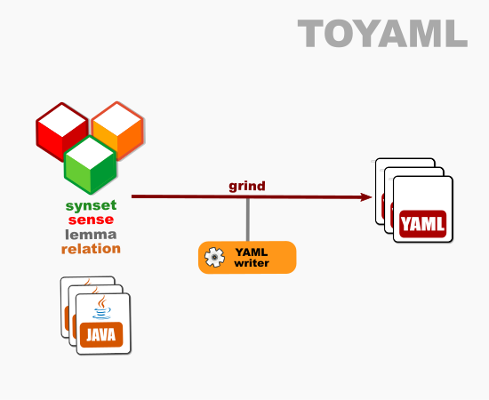

# OEWN model-to-YAML

This writes a model to YAML format.

Project [toyaml](https://github.com/oewntk/toyaml)

## Dataflow

## Maven Central

		<groupId>io.github.oewntk</groupId>
		<artifactId>toyaml</artifactId>
		<version>2.4.0</version>
